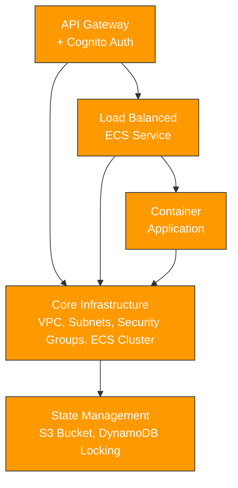

# CleanLink Portal API - Terraform Infrastructure

This repository contains modular Terraform configurations for deploying a containerized application on AWS Fargate with API Gateway and Cognito authentication. The infrastructure is designed to be scalable, secure, and easily maintainable across development and production environments.

## Architecture Overview

The infrastructure follows a layered approach with modular components:

## Modules

### State Management

- Purpose: Manages Terraform state for all infrastructure
- AWS Services: S3, DynamoDB
- Key Features:
  - S3 bucket for state storage with versioning
  - DynamoDB table for state locking
  - Encryption and access controls

### Core Infrastructure

- Purpose: Provides the foundational network and compute resources
- AWS Services: VPC, ECS, CloudMap, Security Groups
- Key Features:
  - VPC with public/private subnets across 3 AZs
  - ECS Fargate cluster with capacity providers
  - Service discovery namespace
  - Security groups for container traffic
  - VPC peering with default VPC for database connectivity

### Container Registry

- Purpose: Stores and manages Docker container images
- AWS Services: ECR
- Key Features:
  - ECR repository for application images
  - Integration with ECS deployment

### Load Balanced Service

- Purpose: Deploys containerized applications with proper networking
- AWS Services: ECS Fargate, ALB, CloudWatch, Service Discovery
- Key Features:
  - ECS service deployment with Fargate
  - Application Load Balancer for request distribution
  - Health checks and autoscaling
  - CloudWatch logging and monitoring
  - Service discovery integration

### API Gateway

- Purpose: Provides secure API endpoints with authentication
- AWS Services: API Gateway, Cognito, ACM, CloudWatch, Route53
- Key Features:
  - HTTP API Gateway with custom domain
  - SSL certificates for secure connections
  - Cognito user pools for authentication with two client types:
    - Server-to-server via client credentials flow
    - User authentication via authorization code flow
  - JWT authorization for API requests
  - Comprehensive logging and monitoring

## Environment Support

The infrastructure supports both development and production environments:

- Development: Fully deployed environment for testing and development
- Production: Configured but commented out in the root module, sharing the same Cognito authentication from development via SSM parameters

## Getting Started

1. Initialize Terraform:
   terraform init
2. Deploy the infrastructure:
   terraform apply
3. Access the API:

   - Development: https://dev-api.cleanlinkportal.co.uk
   - Authentication: https://cleanlink-auth-portal-api.auth.eu-west-2.amazoncognito.com

## Authentication

Two authentication methods are supported:

1. Server-to-server: Uses client credentials flow with client ID/secret
2. User authentication: Uses authorization code or implicit flow with username/password

## API Usage

Example using Postman:

- Authentication: OAuth 2.0
- Grant Type: Authorization Code (for user auth) or Client Credentials (for server auth)
- Auth URL: https://cleanlink-auth-portal-api.auth.eu-west-2.amazoncognito.com/oauth2/authorize
- Token URL: https://cleanlink-auth-portal-api.auth.eu-west-2.amazoncognito.com/oauth2/token
- Callback URL: https://oauth.pstmn.io/v1/browser-callback
- Scope: openid email profile api/health

---

This infrastructure is designed to be secure, scalable, and maintainable with modular components that can be independently updated and expanded.
